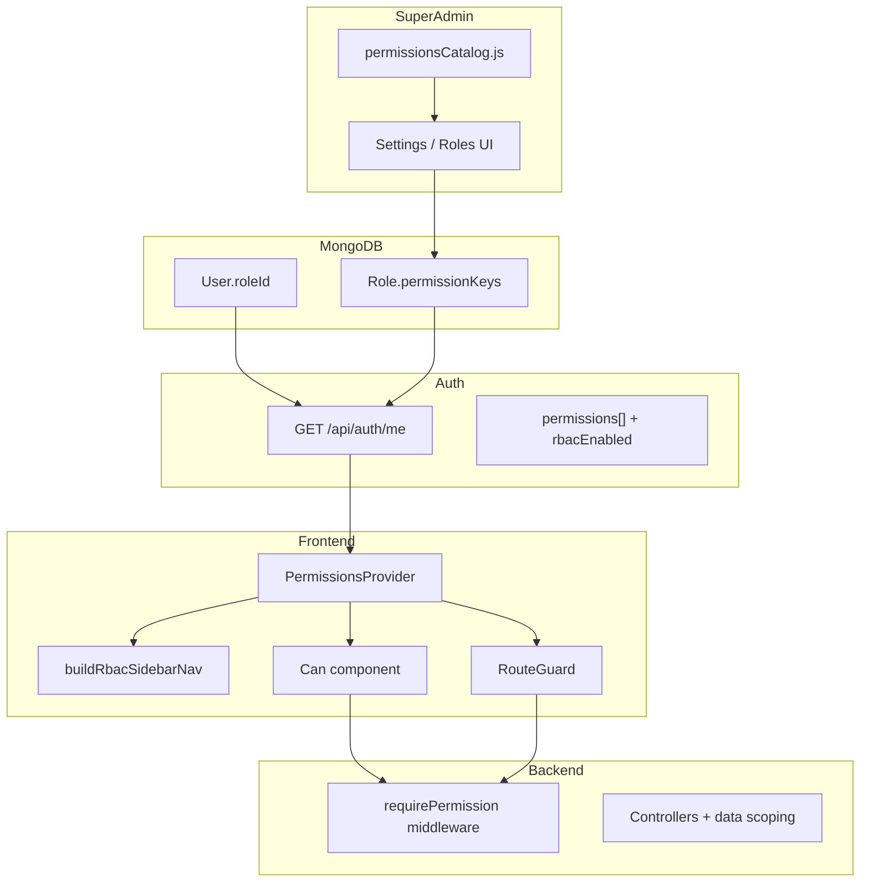

# Dynamic RBAC — Roadmap

This document is the **single source of truth** for finishing Role-Based Access Control (RBAC) in the CRM. For a short “how to add one permission” guide, see [navbar-landing/docs/RBAC.md](../navbar-landing/docs/RBAC.md).

**Related docs:** [QA CRM Testing Guide — RBAC section](./QA-CRM-TESTING-GUIDE.md#g-rbac-critical)

---

## 1. Executive summary

| Item | Detail |
|------|--------|
| **Goal** | Custom roles control **sidebar navigation**, **page access** (deep links), **UI actions**, and **API mutations** using one catalog key per capability. |
| **Current maturity** | **~40%** — foundation shipped; backend API parity and frontend action guards are incomplete. |
| **Primary app** | [Desktop/CRM](../) — `npm run dev` (port **3001**) |
| **API** | [backend/](../backend/) — port **5001**, proxied via `next.config.mjs` `/api/*` |
| **Roles UI** | `/dashboard/settings/roles` (Super Admin only) |
| **Env** | `RBAC_ENABLED` — set to `false` to disable enforcement (legacy fallback). Super Admin emails: `SUPER_ADMIN_EMAILS`. |

---

## 2. Architecture



### Data flow (user session)

1. Super Admin defines **Role** documents with `permissionKeys[]` in MongoDB.
2. Admin assigns **`User.roleId`** (Active Employees → Permission Role).
3. On login / `/api/auth/me`, backend loads keys via [backend/utils/permissions.js](../backend/utils/permissions.js) → `buildAuthPayload`.
4. Frontend stores user + `permissions` in `localStorage` (`authUser`).
5. **Sidebar** builds from [lib/rbac-nav.ts](../lib/rbac-nav.ts) + `canAccessHref`.
6. **RouteGuard** blocks pages without matching page key ([lib/access.ts](../lib/access.ts)).
7. **API** should return **403** without matching page/button key (`requirePermission`).

---

## 3. Permission model

Keys use dot notation: `{module}.{resource}.{action}`.

| Type | Key pattern | Used for |
|------|-------------|----------|
| **module** | `{module}.module.view` | Grouping in Roles UI (toggle all keys in module) |
| **page** | `{module}.{resource}.page.view` | Sidebar links, RouteGuard, read/list APIs |
| **button** | `{module}.{resource}.{action}` | Buttons, POST/PUT/DELETE APIs |

### Source files (keep in sync)

| File | Purpose |
|------|---------|
| [backend/constants/permissionsCatalog.js](../backend/constants/permissionsCatalog.js) | Canonical `PAGE_ENTRIES`, `BUTTON_ENTRIES`, `ROLE_TEMPLATE_KEYS` |
| [backend/scripts/seedPermissions.js](../backend/scripts/seedPermissions.js) | Seed Permission + Role documents |
| [lib/nav-permissions.ts](../lib/nav-permissions.ts) | `HREF_PERMISSION_MAP`, `permissionForPath()` |
| [lib/rbac-nav.ts](../lib/rbac-nav.ts) | Full sidebar tree for RBAC users (`buildRbacSidebarNav`) |
| [lib/access.ts](../lib/access.ts) | `canAccessPath`, `canAccessHref` |
| [lib/route-permissions.ts](../lib/route-permissions.ts) | Exempt routes (`/dashboard` home) |
| [components/permissions/PermissionsProvider.tsx](../components/permissions/PermissionsProvider.tsx) | Context + `/auth/me` refresh |
| [components/permissions/RouteGuard.tsx](../components/permissions/RouteGuard.tsx) | Page-level deny UI |
| [components/permissions/Can.tsx](../components/permissions/Can.tsx) | Button-level visibility |
| [components/dashboard/Sidebar.tsx](../components/dashboard/Sidebar.tsx) | Legacy role menus + RBAC nav merge |
| [backend/middleware/permissionMiddleware.js](../backend/middleware/permissionMiddleware.js) | `requirePermission`, `requirePermissionWhen` |

### After catalog changes

```bash
node backend/scripts/seedPermissions.js
# Restart backend, re-open Roles UI, re-save affected roles if needed
```

**Users must sign out and sign in again** (or use **Refresh my permissions** on the Roles page) after their role’s permissions change.

---

## 4. What is done

| Area | Status | Key files |
|------|--------|-----------|
| Permission catalog + seed | Done | `permissionsCatalog.js`, `seedPermissions.js` |
| Roles CRUD UI | Done | `app/dashboard/settings/roles/page.tsx` |
| User `roleId` assignment | Done | `userRoleRoutes.js`, Active Employees UI |
| Auth payload with permissions | Done | `utils/permissions.js` → `buildAuthPayload` |
| Sidebar from permissions | Done | `lib/rbac-nav.ts`, `buildRbacSidebarNav` in `Sidebar.tsx` |
| Route deep-link guard | Done | `RouteGuard`, `nav-permissions.ts` |
| Hydration-safe provider | Done | `PermissionsProvider` (no `localStorage` in `useState` initializer) |
| Partial API guards | Partial | 8 route files (see below) |
| Pilot `<Can>` components | Partial | Mostly under `navbar-landing/` duplicates |
| Legacy `User.role` page guards | WIP | 40+ pages in `app/dashboard` still check role strings |
| Mobile app RBAC | Not started | `mobile-view/` |

### Backend routes using `requirePermission` (today)

- `settingsRoutes.js`
- `stockReturnRoutes.js`
- `expenseRoutes.js` (partial)
- `paymentRoutes.js` (partial)
- `productRoutes.js`
- `employeeRoutes.js` (partial)
- `dcOrderRoutes.js` (partial)
- `dcRoutes.js` (partial)

### Backend routes still on `roleMiddleware` or auth-only (backlog)

`leaveRoutes`, `leadRoutes`, `trainingRoutes`, `trainerRoutes`, `serviceRoutes`, `warehouseRoutes`, `executiveManagerRoutes`, `sampleRequestRoutes`, `zoneRoutes`, `clusterRoutes`, `zoneClusterRoutes`, `vendorRoutes`, `vendorCostRoutes`, `deliverableRoutes`, `programBillingRoutes`, `reportRoutes`, `salesRoutes`, `dashboardRoutes`, `attendanceRoutes`, `contactQueryRoutes`, `franchiseRoutes`, `aiRoutes`, `apiKeyRoutes`, `empDcRoutes`, and others.

---

## 5. Known gaps

| Gap | Impact | Recommended action |
|-----|--------|-------------------|
| **Zones / Clusters** in sidebar but not in catalog | RBAC users never see them | Add `employees.zones` / `employees.clusters` page keys OR keep legacy Admin-only |
| **Dynamic routes** e.g. `/dashboard/executive-managers/[id]/dashboard` | No catalog key; RouteGuard may deny or allow incorrectly | Add page keys + prefix rule in `permissionForPath`, or document exempt pattern |
| **UI vs API mismatch** | Checkbox allows UI; API returns 403 | e.g. Create Manager: page uses `executive_managers.create.page.view` but API uses `roleMiddleware('Admin')` — align `executiveManagerRoutes.js` |
| **Module vs page** | Users check only page keys; module keys optional | Implement: `*.module.view` grants all pages in module (see Decisions) |
| **Dual codebases** | CRM root vs `navbar-landing/` drift | Sync catalog, `lib/*`, and pages on every RBAC change |
| **Mobile** | App ignores `permissions[]` | Separate milestone: consume `/auth/me` in `mobile-view` |
| **Legacy page guards** | Double denial or bypass vs RouteGuard | Remove `getCurrentUser().role` gates; use RouteGuard + `<Can>` only |

---

## 6. Phased roadmap

### Phase 0 — Stabilize foundation (1–2 days)

- [x] Add this roadmap (`docs/RBAC-ROADMAP.md`)
- [ ] Run `node backend/scripts/seedPermissions.js`; verify Roles UI lists all modules (including Executive Managers)
- [x] Document re-login requirement (this doc + Roles page helper)
- [x] **Refresh my permissions** on Roles page (`refreshPermissions()`)
- [x] Link QA guide to this roadmap

### Phase 1 — Catalog completeness (2–3 days)

- [ ] Audit every `app/dashboard/**/page.tsx` route → add missing entries to catalog, `nav-permissions.ts`, `rbac-nav.ts`
- [ ] Add zones/clusters to catalog OR mark admin-only legacy
- [ ] Define policy for executive-manager dynamic URLs
- [ ] Update `ROLE_TEMPLATE_KEYS` when new keys are added

### Phase 2 — Backend API parity (1–2 weeks, by module)

For each module: map HTTP methods → page or button keys; replace `roleMiddleware` where RBAC should control access.

| Order | Module | Route files |
|-------|--------|-------------|
| 1 | Clients / DC | `dcRoutes.js`, `dcOrderRoutes.js`, `empDcRoutes.js` |
| 2 | Leaves | `leaveRoutes.js` |
| 3 | Leads | `leadRoutes.js` |
| 4 | Executive Managers | `executiveManagerRoutes.js` |
| 5 | Warehouse | `warehouseRoutes.js` |
| 6 | Training / Services | `trainingRoutes.js`, `trainerRoutes.js`, `serviceRoutes.js` |
| 7 | Payments / Expenses | extend existing |
| 8 | Reports | `reportRoutes.js` |
| 9 | Employees | `employeeRoutes.js`, zones/clusters |
| 10 | Remaining | samples, vendors, franchise, AI, API keys (likely Super Admin only) |

### Phase 3 — Frontend cleanup (parallel with Phase 2)

- [ ] Remove `getCurrentUser().role` page gates; rely on `RouteGuard` + `<Can>`
- [ ] Add `<Can>` on pilot pages: closed sales, completed DC, active employees, warehouse returns
- [ ] Port `<Can>` from `navbar-landing/` into CRM `app/` where pages are duplicated
- [ ] Dashboard widgets: permission-based helpers (pattern: `lib/leaveAccess.ts`)

### Phase 4 — Hardening & rollout

- [ ] Execute QA matrix (section 8)
- [ ] Test `RBAC_ENABLED=false` rollback
- [ ] Production: assign `roleId` to all active users; keep `User.role` for display/legacy only
- [ ] Mobile RBAC (optional)

---

## 7. Per-module tracking

Status legend: **Done** | **Partial** | **Not started**

| Module | Catalog | rbac-nav | Route map | API guarded | `<Can>` actions | Legacy guards removed | Status |
|--------|---------|----------|-----------|-------------|-----------------|----------------------|--------|
| dashboard | Done | Done | Done | Partial | N/A | Partial | Partial |
| clients | Done | Done | Done | Partial | Partial | Partial | Partial |
| leads | Done | Done | Done | Not started | Not started | Not started | Not started |
| employees | Done | Done | Done | Partial | Partial | Partial | Partial |
| leaves | Done | Done | Done | Not started | Not started | Partial | Partial |
| training | Done | Done | Done | Not started | Not started | Not started | Not started |
| warehouse | Done | Done | Done | Not started | Partial | Not started | Partial |
| returns | Done | Done | Done | Partial | Partial | Partial | Partial |
| payments | Done | Done | Done | Partial | Not started | Partial | Partial |
| expenses | Done | Done | Done | Partial | Not started | Partial | Partial |
| reports | Done | Done | Done | Not started | Not started | Not started | Not started |
| products | Done | Done | Done | Done | Not started | Partial | Partial |
| settings | Done | Done | Done | Partial | N/A | Partial | Partial |
| executive_managers | Done | Done | Done | Not started | Not started | Partial | Partial |
| samples | Done | Done | Done | Not started | Not started | Not started | Not started |
| vendor | Done | Done | Done | Not started | Not started | Not started | Not started |

**P0 modules for “MVP complete”:** clients, leaves, employees, executive_managers.

---

## 8. QA matrix (smoke per role)

For each **test role** (clone from `executive`, `manager`, `admin` templates):

| Check | Pass criteria |
|-------|----------------|
| Sidebar | Only permitted modules/pages appear |
| Deep link | Paste URL without permission → “Access denied” card (not blank/crash) |
| API | `curl`/Network tab → **403** without permission |
| Button | Action hidden or disabled without button key |
| Re-login | After role save, user sees new menu within one refresh/sign-in |

Denied deep URLs: use [QA-CRM-TESTING-GUIDE.md](./QA-CRM-TESTING-GUIDE.md) section 4 + section G.

---

## 9. How to add a new permission

1. Add to **catalog** — [permissionsCatalog.js](../backend/constants/permissionsCatalog.js):
   - Page: `PAGE_ENTRIES` with `href`, `module`, `resource`, `label`
   - Button: `BUTTON_ENTRIES` with `buttonKey(module, resource, action)`
2. **Seed** — `node backend/scripts/seedPermissions.js`
3. **Frontend maps** — [lib/nav-permissions.ts](../lib/nav-permissions.ts) + [lib/rbac-nav.ts](../lib/rbac-nav.ts)
4. **API** — `requirePermission('module.resource.page.view')` or button key on route
5. **UI action** — `<Can permission="module.resource.action">...</Can>`
6. **Smoke** — Assign to test role → sign out/in → sidebar + URL + API

Example (button):

```tsx
import { Can } from '@/components/permissions/Can'

<Can permission="clients.closed_sales.request_dc">
  <Button onClick={requestDc}>Request DC</Button>
</Can>
```

Example (API):

```js
const { requirePermission } = require('../middleware/permissionMiddleware');
router.post('/raise', authMiddleware, requirePermission('clients.closed_sales.approve_dc'), raiseDC);
```

---

## 10. Exit criteria (“RBAC complete”)

- [ ] No feature gated **only** by `User.role` string (except Super Admin bypass and intentional controller data-scoping).
- [ ] Every catalog **page** key appears in sidebar when granted, or omission is documented.
- [ ] Every catalog **button** key returns **403** from API when missing.
- [ ] Custom roles cloned from Executive and Manager templates pass full QA matrix.
- [ ] P0 module rows in section 7 are **Done** for Catalog, Nav, Route map, API, and Legacy guards.

---

## 11. Decisions log

| Decision | Options | Recommendation | Status |
|----------|---------|----------------|--------|
| Module vs page grants | Pages only vs module auto-includes pages | When `*.module.view` is checked, grant all page keys in that module | **TODO** (UI already toggles module keys together; enforce in `hasPermission`) |
| Legacy `User.role` | Remove vs keep for display | Keep enum; **`roleId` + `permissions[]`** are source of truth | Adopted |
| Row-level security | RBAC keys vs “only my executives” | RBAC = capability; controllers keep team scoping | Adopted |
| Who edits roles | Any Admin vs Super Admin only | Super Admin only (`requireSuperAdmin` on `/api/roles`) | Adopted |
| Sidebar for RBAC | Filter static NAV vs build from catalog | **buildRbacSidebarNav** from full catalog | Adopted |

---

## 12. Pilot reference (implemented patterns)

| Area | Page / action | Permission keys |
|------|---------------|-----------------|
| Completed DC | View / replace PDF | `warehouse.completed_dc.view_pdf`, `warehouse.completed_dc.replace_pdf` |
| Closed Sales | Request / approve DC | `clients.closed_sales.request_dc`, `clients.closed_sales.approve_dc` |
| Active employees | Add / edit / delete | `employees.active.add`, `employees.active.edit`, `employees.active.delete` |
| Returns (warehouse) | Verify / approve | `returns.warehouse.verify`, `returns.warehouse.approve` |
| Leave dashboard widgets | Section visibility | `leaves.*.page.view` via `lib/leaveAccess.ts` |

Always use the **same key** on the matching API route.

---

## 13. Sync checklist (CRM + navbar-landing)

When changing RBAC, update **both** trees (or confirm CRM is the only deploy target):

- [ ] `backend/constants/permissionsCatalog.js`
- [ ] `lib/nav-permissions.ts`, `lib/rbac-nav.ts`, `lib/access.ts`
- [ ] `components/permissions/*`, `components/dashboard/Sidebar.tsx`
- [ ] `app/dashboard/**` pages affected
- [ ] Run seed + smoke test

---

*Last updated: roadmap initial publish. Update section 7 status as modules are completed.*
